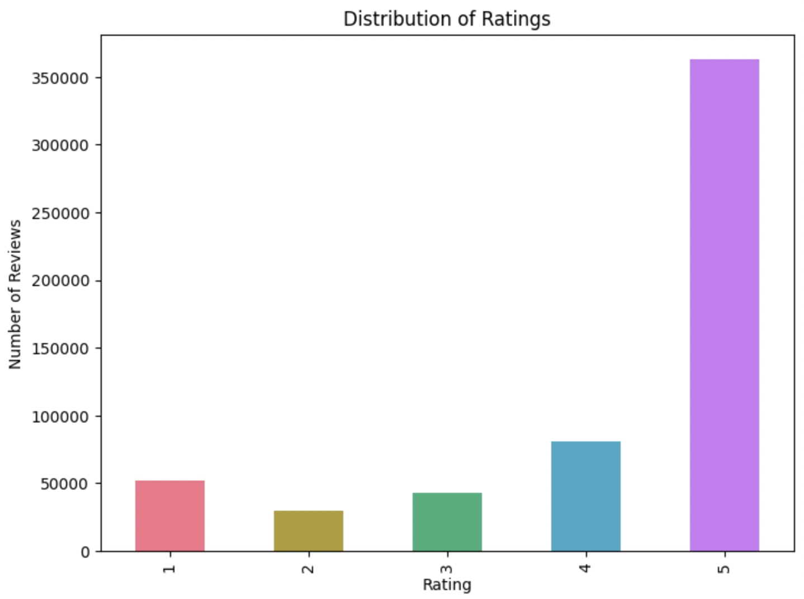
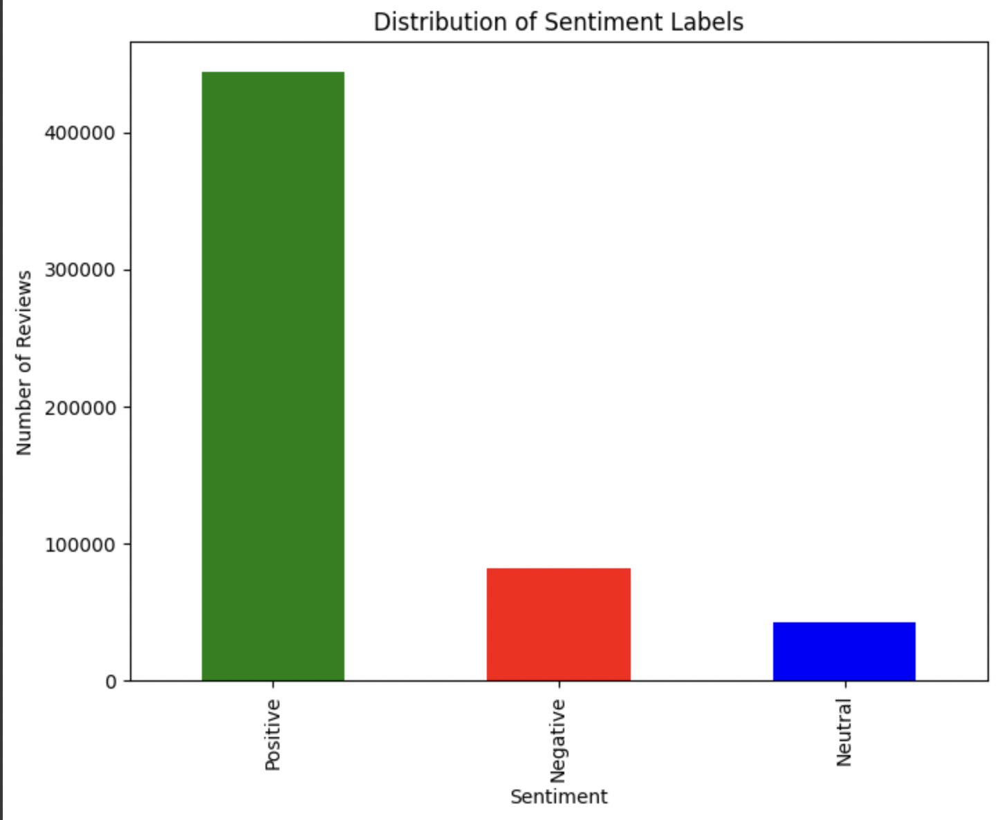
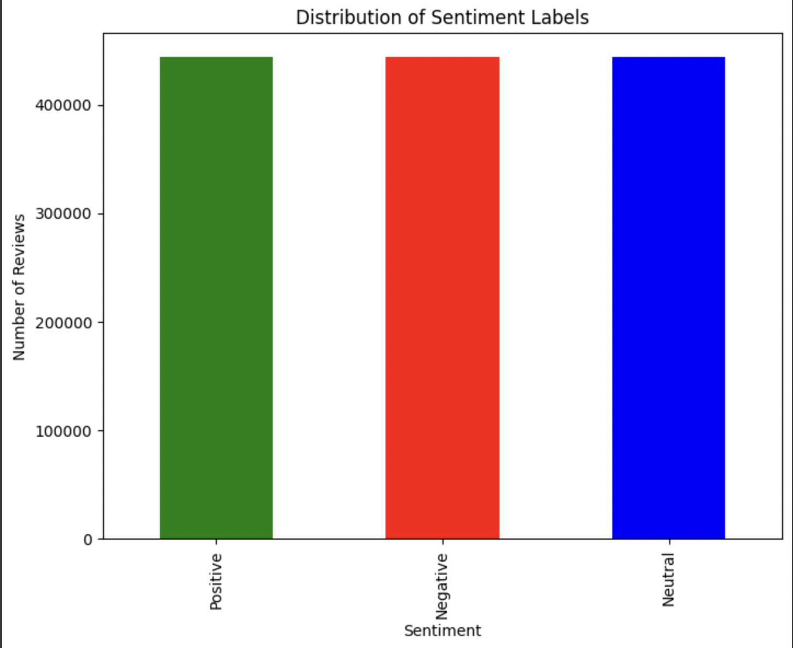

# 📘 NLP Project: Sentiment Analysis on Amazon Fine Food Dataset Reviews

## 📌 Project Overview
This project focuses on **Sentiment Analysis** using the **Amazon Fine Food Reviews Dataset**. Sentiment analysis is a crucial aspect of business intelligence, enabling companies to refine their strategies based on customer opinions. **NLP (Natural Language Processing)** is a fundamental part of AI, and sentiment analysis is one of its most well-known applications.

The aim of this project is to classify user reviews into **three sentiment categories: Positive, Neutral, and Negative**. We explored various architectures, starting from **classical Machine Learning (ML) algorithms** and gradually increasing complexity by experimenting with **Deep Learning (DL) architectures**.

One of the key challenges in this dataset is **class imbalance**, as the reviews are skewed towards the positive class. This imbalance can impact the model's ability to correctly classify Neutral and Negative sentiments. To address this, we implemented **two approaches**:
1. **Testing complex deep learning architectures** while ensuring computational efficiency for real-world deployment.
2. **Oversampling (Random Over-Sampling)** to balance the dataset and improve classification performance.

Since the dataset is highly imbalanced, we primarily rely on **Precision, Recall, and F1-score** for evaluation, as accuracy alone is not informative in this scenario.

# Amazon Fine Food Reviews Dataset

## 📊 Dataset

- **Dataset Used**: Amazon Fine Food Reviews Dataset  
- **Source**: [Kaggle](https://www.kaggle.com/datasets/snap/amazon-fine-food-reviews)  
- **Size**: 568,454 reviews  
  - **Number of unique products**: 74,258  
  - **Number of unique users**: 256,059  
  - **Number of categories**: 12 (e.g., Bakery, Beverages, etc.)  
- **Description**:  
  The Amazon Fine Food Reviews Dataset contains user-generated reviews of food products sold on Amazon. This dataset includes a rich set of metadata including:
  - Review text
  - User ratings (from 1 to 5 stars)
  - Product ID and category
  - User ID
  - Review timestamps

### Class Distribution by Rating:
- **Rating 1 (Negative)**: 72,551 samples  
- **Rating 2**: 45,780 samples  
- **Rating 3 (Neutral)**: 108,220 samples  
- **Rating 4**: 158,315 samples  
- **Rating 5 (Positive)**: 183,588 samples

<b>Distribution of Ratings</b>

<b>Distribution of Classes </b>

<b>Distribution of Classes after oversampling </b>
 

---

## 📁 Files Included

- **`Reviews.csv`**: Contains the main dataset with the review details (review ID, product ID, user ID, review text, rating, etc.)

---

## 🔍 Dataset Features

- **Review ID**: Unique identifier for each review.
- **User ID**: Identifier for the user who submitted the review.
- **Product ID**: Identifier for the product being reviewed.
- **Product Category**: Category to which the product belongs (e.g., Bakery, Beverages).
- **Rating**: The rating given by the user (from 1 to 5 stars).
- **Review Text**: The content of the user's review.
- **Timestamp**: The time when the review was submitted.

---

## 🔧 Usage

This dataset can be used for various tasks such as:

- **Sentiment Analysis**: Analyzing the sentiment of user reviews (positive/negative/neutral).
- **Text Classification**: Categorizing reviews based on ratings or product categories.
- **Recommendation Systems**: Building models for product recommendations based on user reviews and ratings.
- **Natural Language Processing (NLP)**: Preprocessing text data, tokenization, and other NLP tasks.

---

## 📥 How to Use

1. Download the dataset from [Kaggle](https://www.kaggle.com/datasets/snap/amazon-fine-food-reviews).
2. Load the data into your environment using Pandas or another data analysis library.
3. Explore the data to understand the relationships between ratings, review text, and product information.

---

## 📄 References

- The dataset can be accessed directly from [Kaggle](https://www.kaggle.com/datasets/snap/amazon-fine-food-reviews).
- More information on Amazon product reviews and datasets can be found in various research papers and articles that discuss product recommendation systems and sentiment analysis.

---

## 🚀 Implementation Steps

### 1. **Data Preprocessing**
   - **Text Cleaning**: We cleaned the text by removing stopwords, punctuation, and converting everything to lowercase.
   - **Tokenization & Lemmatization**: The text was split into individual tokens (words), and each token was reduced to its base form using lemmatization.
   - **Feature Extraction**:
     - **TF-IDF with Bigrams**: We used **TF-IDF** to convert text data into numerical features. **Bigrams** (pairs of consecutive words) were used to capture more context in the data, which is beneficial for understanding sentiment.
     - **GloVe Embeddings**: We used **GloVe** word embeddings (50-dimensional vectors) with a **vocabulary size of 10,000 words**. GloVe allows the model to understand word meanings more efficiently in a low-dimensional space.

### 2. **Exploratory Data Analysis (EDA)**
   - **Sentiment Distribution**: We analyzed how the sentiment (positive, negative, neutral) is distributed across the dataset.
   - **Statistical Insights**: We explored key statistics such as average review length and frequent words to better understand the nature of the dataset.

### 3. **Model Training & Evaluation**
   - **Applied Models on Both Original and Oversampled Datasets**:
     - **CNN (Convolutional Neural Networks)**: Used to capture important features in the text and identify patterns that contribute to sentiment.
     - **LSTM (Long Short-Term Memory)**: Employed to capture the sequential dependencies and long-term relationships in the text data.
     - **Bi-directional LSTM**: A Bi-directional LSTM was used to process the text in both forward and backward directions, providing better context for sentiment prediction.
     - **LSTM + CNN Hybrid Architecture**: A hybrid model that combines the strengths of both LSTM and CNN to better capture sequential dependencies and important features.
   - **Performance Evaluation**: Models were evaluated based on **accuracy**, **F1-score**, and **CPU time** to ensure the models are not only accurate but also efficient for real-world applications.

---

## 🔒 License

- This dataset is provided by Kaggle under the terms of the [Kaggle Dataset License](https://www.kaggle.com/datasets/snap/amazon-fine-food-reviews).

## 🛠️ Technologies Used
- **Programming Language**: Python 🐍
- **Libraries & Frameworks**: Pandas, NumPy, Scikit-Learn, NLTK, TensorFlow, SpaCy

## 📜 License
This project is licensed under the MIT License - see the [LICENSE](LICENSE) file for details.

## 🤝 Contributing
Feel free to contribute to this project by submitting issues or pull requests. For major changes, please open a discussion first.

## 📬 Contact
For any queries, reach out to **Eldar Eyvazov** at [Your Email/LinkedIn].

---
🚀 **Happy Coding!**
